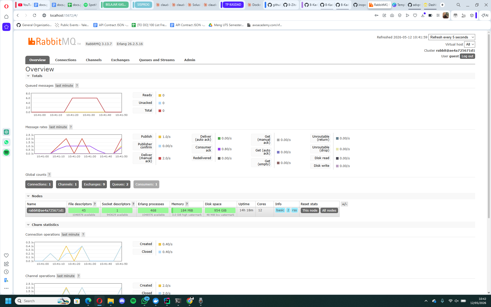
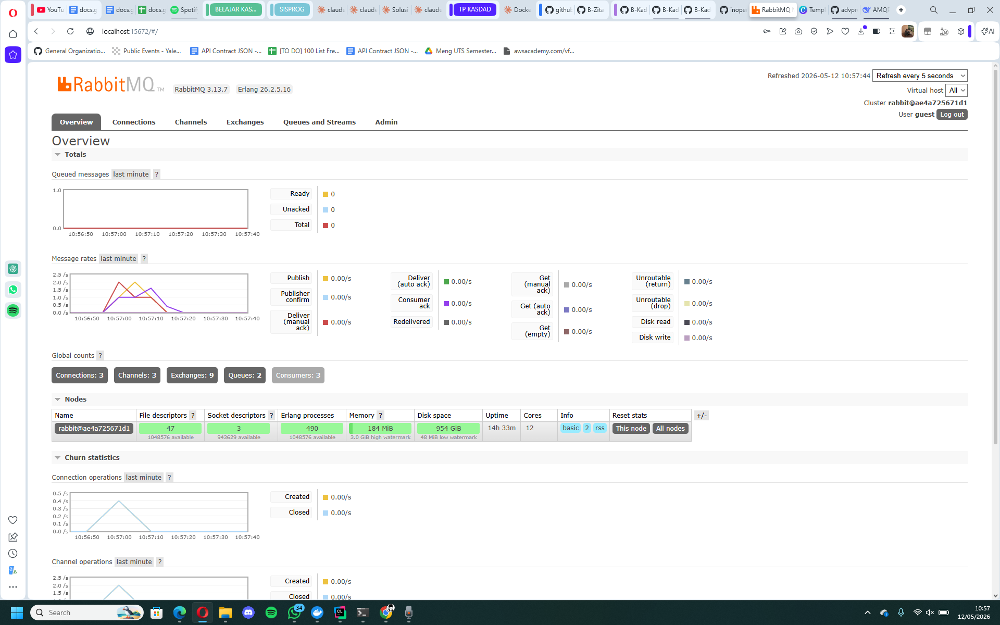

Nama: Zita Nayra Ardini 
NPM: 2406404913 
Kelas: Pemrograman Lanjut B

# Reflection notes
## Jawaban Pertanyaan
a. Apa itu AMQP?
AMQP (Advanced Message Queuing Protocol) adalah protokol standar terbuka untuk message-oriented middleware. Protokol ini memungkinkan komunikasi asinkron antar aplikasi atau komponen yang berbeda, dengan dukungan fitur seperti routing, queuing, reliability, dan keamanan. Dalam tutorial ini, RabbitMQ menggunakan AMQP sebagai protokol utama untuk mengirim dan menerima pesan antara publisher, message broker, dan subscriber.

b. Apa arti guest:guest@localhost:5672?
String guest:guest@localhost:5672 adalah URL yang digunakan oleh publisher dan subscriber untuk terhubung ke message broker RabbitMQ. Bagian guest:guest menunjukkan username dan password default bawaan RabbitMQ, sedangkan localhost merujuk pada alamat host tempat broker berjalan. Angka 5672 adalah port default untuk protokol AMQP (non-TLS). Karena URL ini sama persis pada kode publisher dan subscriber, artinya kedua program terhubung ke broker yang sama, sehingga mereka dapat bertukar pesan melalui queue dengan nama yang sama (user_created).

## Simulasi Slow Subscriber
### Screenshot queue menumpuk

### Mengapa total queue bisa mencapai angka tersebut?
Karena setiap kali publisher dijalankan, ia mengirim 5 event sekaligus ke queue. Sementara subscriber yang slow membutuhkan 1 detik untuk memproses setiap event. Jika publisher dijalankan 4 kali (= 20 event), dan subscriber baru selesai memproses 1-2 event, maka sisa event menumpuk di queue. RabbitMQ berperan sebagai buffer yaitu menyimpan event yang belum diproses agar tidak ada yang hilang, dan subscriber akan memprosesnya satu per satu secara bertahap.

## Simulasi Multiple Subscribers
### Screenshot multiple subscribers

### Mengapa queue berkurang lebih cepat dengan 3 subscriber?
Dengan tiga subscriber yang berjalan paralel, RabbitMQ akan mendistribusikan event secara bergantian (round-robin) ke masing-masing subscriber. Apabila satu subscriber memerlukan waktu satu detik untuk memproses satu event, maka tiga subscriber secara bersamaan dapat memproses tiga event per detik. Hasilnya, kecepatan pemrosesan menjadi tiga kali lipat. Inilah salah satu keunggulan arsitektur event‑driven: kita dapat meningkatkan kinerja secara horizontal hanya dengan menambah jumlah instance subscriber, tanpa perlu mengubah kode publisher.

### Apa yang bisa diperbaiki dari kode ini?
Beberapa aspek yang dapat ditingkatkan dari kode yang ada antara lain:
- Pada Publisher, tidak ada mekanisme konfirmasi bahwa event benar-benar sampai ke broker (penanganan acknowledgment kurang memadai).
- Pada Subscriber, penggunaan loop {} kosong di main() menyebabkan busy‑wait yang membuang sumber daya CPU. Sebaiknya diganti dengan teknik blocking yang lebih efisien.
- Pada Koneksi, string koneksi AMQP ditulis keras (hardcoded). Sebaiknya dibaca dari variabel env atau berkas konfigurasi agar lebih fleksibel dan aman.
- Pada Penanganan error, penggunaan unwrap() berisiko menyebabkan panic jika koneksi gagal. Sebaiknya diganti dengan penanganan error yang lebih baik seperti penggunaan enum Result.

